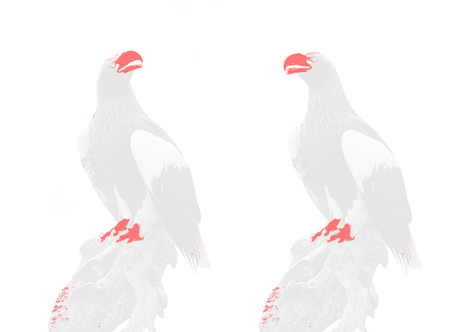

# pixelmatch-wasm

A pixel-level image comparison library powered by wasm and SIMD feature, originally created to compare screenshots in tests.

This library is ported from [mapbox/pixelmatch](https://github.com/mapbox/pixelmatch/)

## Install

``` sh
npm i @bokuweb/pixelmatch-wasm
```

## Usage

```js
import { pixelmatch } from "@bokuweb/pixelmatch-wasm";

pixelmatch(img1, img2, 800, 600, { threshold: 0.1 });
```

## Examples

- [webpack](https://github.com/pixelmatch-rs/examples/webpack)
- [vite](https://github.com/pixelmatch-rs/examples/vite)
- [node(cjs)](https://github.com/pixelmatch-rs/examples/node/cjs)
- [node(esm)](https://github.com/pixelmatch-rs/examples/node/esm)

## Demo


| before.png        | after.png          | diff.png                 |
| --------------- |---------------| -------------------- |
|  |  ||


## API

### pixelmatch(img1: Uint8Array, img2: Uint8Array, width: number, height: number, options?: PixelmatchOptions): { count: number; diff: Uint8Array };

- `img1`, `img2` — Image data of the images to compare. **Note:** image dimensions must be equal.
- `width`, `height` — Width and height of the images. Note that _all three images_ need to have the same dimensions.

`options` is an object literal with the following properties:

``` typescript
type PixelmatchOptions = {
  includeAntiAlias: boolean;
  threshold: number;
  diffColor: [number, number, number, number];
  antiAliasedColor: [number, number, number, number];
};
```

- `threshold` — Matching threshold, ranges from `0` to `1`. Smaller values make the comparison more sensitive. `0.1` by default.
- `includeAntiAlias` — If `true`, disables detecting and ignoring anti-aliased pixels. `false` by default.
- `diffColor` — The color of differing pixels in the diff output in `[R, G, B, A]` format. ` [255, 119, 119, 255]` by default.
- `antiAliasedColor` — The color of anti-aliased pixels in the diff output in `[R, G, B, A]` format. `[243, 156, 18, 255]` by default.

